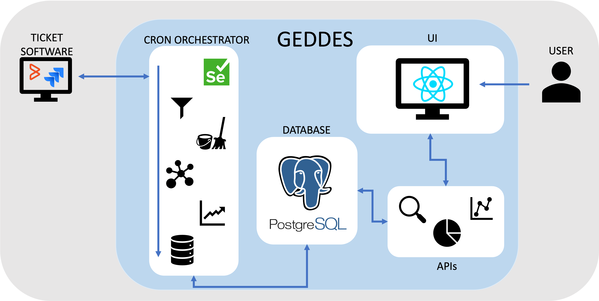
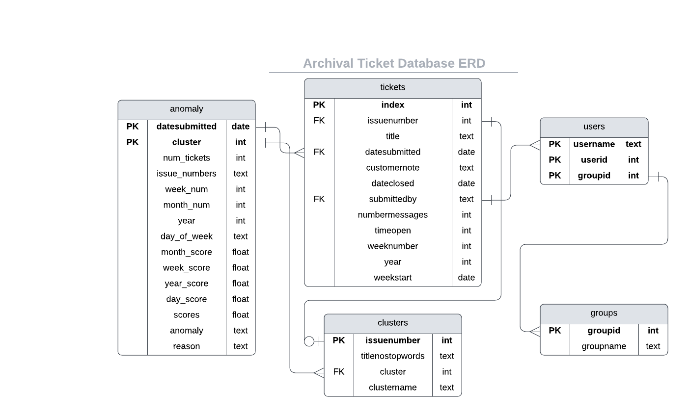

# TicketHub

## About TicketHub
TicketHub is an application that uses modern Natural Language Processing (NLP) techniques to provide a dynamic, temporal, and holistic view of High-Performance Computing (HPC) support requests (tickets).  This project extends, and automates, previous ticket analysis efforts by utilizing modern semantic and unsupervised NLP techniques to better understand the context of messages, while remaining robust with respect to shifting ticket topics over time.

In addition to general statistics and metrics, capabilities include reindexing ticket data to provide a semantic search feature and temporally clustering ticket data to understand message topics over time. The application also includes an ML-informed pre-processing pipeline to improve downstream accuracy.  All these capabilities have been packaged into a web application with automatic data ingestion and interactive metrics.  The application has been containerized and deployed on Purdue’s composable cluster, Geddes, using Kubernetes. Overall, the application seeks to be an all-in-one resource for analyzing ticket content and trends, and initial analyses have demonstrated the utility of this resource to aid future user support work by identifying common issues experienced by users, find opportunities for targeted training sessions, and help staff find previous resolutions to similar issues to increase the efficiency of ticket responses.

This project was initially presented at PEARC'23 and additional details can be found in the accompanying paper.

## Application Architecture
* __Overview of Architecture__

* __Deployment__: All services were deployed using Docker and Kubernetes on the Geddes cluster at Purdue. There are 4 primary deployments: a PostgreSQL database server, the React UI, a flask app for doing all of the necessary searches and queries, and then cron jobs to prepare and ingest new data to keep the application updated. 

    The UI, search, and cron job deployments all use a shared multi-node persistent storage volume to easily transfer, update, and use supporting files, like credentials and saved embeddings, as well as to keep record of processed and ingested data. The database also uses a persistant storage volume.

    A load balancer service was added to the database deployment, and ingresses added to the UI and search API deployments.  Of the deployments, the most resource intensive are the cron job and search deployments due to running models or ML-adjacent tasks, like creating embeddings.  Performance was improved by increasing the CPU minimum CPU resources allocated to these deployments. 
* __Database Schema__:

## Repository Structure
An overview of the most important parts of the repository structure can be found below:

* __Anvil__: This folder contains all of the code for the Jira integration (ITSM used for ACCESS/Anvil tickets).  It contains the workflow and deployment files for the weekly update cron job as well as the initial data pulls and data processing.  The weekly update folder follows a similar structure to that listed in the FPNewDataPull folder.
    
    * _0_run_report.sh_ is the main caller file that controls what happens when the cron job runs. This runs each of the below files in turn. 

    * _1_gen_new_report.py_ is a script that will automate pulling new data from the ticket software. This is the main script that needs to be changed to adapt this application to another ticketing system or another research computing center. **To run this, you must have a local file  containing encrypyed login credentials for the ticketing system.**  The file also does initial processing to filter out any data in the report that had previously been ingested and to do initial preprocessing of the data including adding derived columns and preprocessing text.

    * _2_cluster_emb_prep.py_  does additional preparation of ticket data for ingestion, including running the BERTopic clustering model to predict the clusters of new data as well as update the clusters as needed based on shifting ticket topics.

    * _3_cluster_ingest.py_ ingests the ticket and cluster results into the database. This happens first as the anomaly model utilizes the clustering results.

    * _4_anomaly_model.py_ This file is similar to the cluster_emb_prep script in that it runs a model (the cluster-wise anomaly detection model) and prepares the results to be ingested into a database table. This enables anomaly visualizations to be rapidly generated in the UI.
    
    * _5_anomaly_ingest.py_ ingests the anomaly model results into the database.

    * Additionally within this folder are files to enable containerization -- the Dockerfile, requirements.txt, and builddocker_jira.sh, a shell script to build and push the container.

* __DataPrepAndExperimentation__: This folder contains python scripts for initial database creation (clustering_initial.ipynb and prep_initial_data_for_db.ipynb) as well as intermediate scripts created during development.

* __FPNewDataPull__: This folder contains all code necessary to perform automated data ingestion from Footprints and model updates with new data.  There are two subfolders in this directory -- the first contains everything necessary to containerize and deploy the weekly data updates (deployed as a cron job scheduled to run every Sunday night at midnight) and the second contains all code necessary for quarterly updates to user/group affiliation information. The weekly update folder follows a similar structure to that listed in the Anvil folder, but the workflow is older and the Anvil workflow should be used as a guide for future work. Note changes below:

    * run_report.sh: After all of the preparatory scripts have been run, the FP version also scales the search deployment pod down (pod_scale_down.sh) before ingesting new prepped data into the database and then scaling the deployment back up (pod_scale_up.sh). **Pod scaling requires a local kubeconfig file to be in this directory.**  Note: the scaling process was utilized for Footprints ingestions but this process is no longer required for other ITSM integrations.

    * gen_new_report.py: For Footprints, a Selenium script was used to pull new data due to an inability to directly access the database/lack of API options.

    * _relevancy_filter.py_ applies the _PredictorModel_ to the preprocessed data to filter out irrelevant messages in each ticket that could dilute the quality of text embeddings. This model was not used for Anvil tickets.

    * _ingestion.py_ This script runs code to embed and ingest the new data into the database.  In the FP integration, all ingestion is done at once due to scaling, and this file is used instead of the separate cluster_ingest and anomaly_ingest files.

    * _usergroup_update.py_ Is run on a quarterly basis and connects with RCAC apis to retrieve user and group information for all users submitting who have submitted tickets. This data is not expected to change frequently hence the more infrequent run.

    * _usergroup_ingestion.py_ Updates the user and group tables in the database with the information found and pre-processed in the usergroup_update.py file

* __PGVector__: This folder contains the Dockerfile for deploying a postgres database server with PGVector dependencies installed. The resulting image was used for the TicketHub database deployment.

* __ReactUI__: This contains all of the code for current the React frontend.

* __RelevancyFilter__: Doccano was used to facilitate annotation of tickets in developing a message relevancy model.  The code to train this model can be found in relevancyFilter.py, with documentation on the model in Overview.md. This folder also contains helper files used in the Doccano deployment (label_config.json and Instructions.md).  While the data we used for annotation also included metadata as additional context, the primary fields needed are IssueNumber and CustomerNote. Note: this model was only used in the FootPrints implementation, as it did not have a large effect for the small Anvil corpus.

* __Search__: Contains all necessary files for the backend that performs semantic search and database querying. This service is composed as a flask app. **This folder requires a local file creds.json containing encrypted database login information.**

* __Streamlit__: DEPRECATED; DO NOT USE. This folder contains all necessary files for running the initial Streamlit UI which has been replaced by the React front end described below. Within the data folder is the config.yaml which defines a list of users pre-authorized to create accounts on the application as well as encrypted login information.  This folder should be moved to /mnt/data/search in the persistent storage.  The db_creds.txt file should also be included here. **These files must be created locally first** The streamlit directory also contains files necessary to containerize the service as well as branding (favicon and logo).

